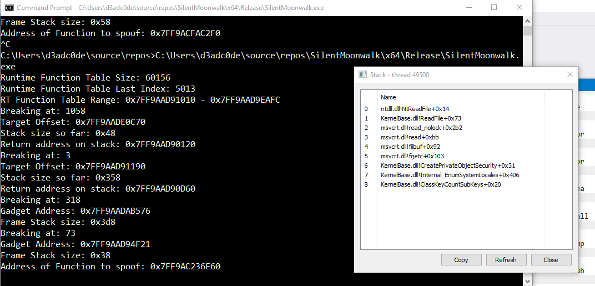
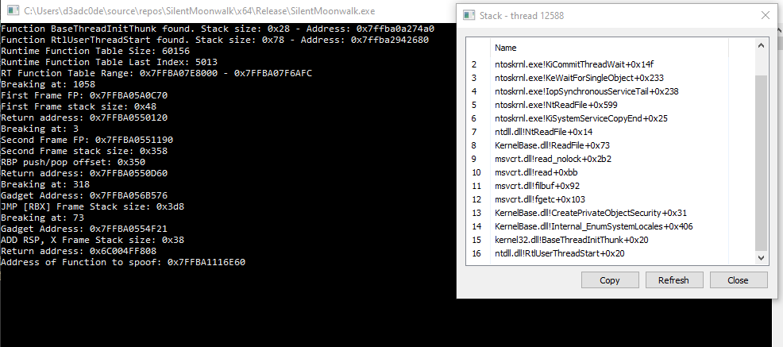
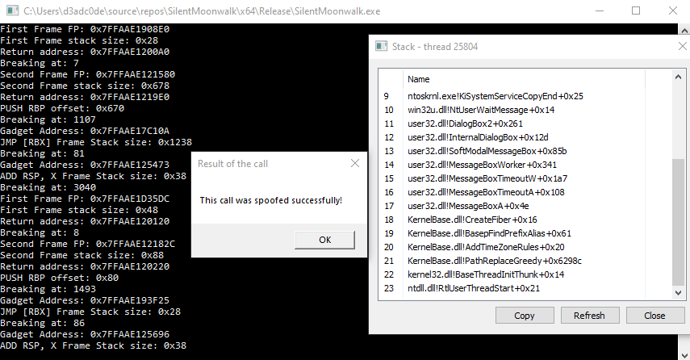

# SilentMoonwalk

PoC Implementation of a true call stack spoofer

## TL;DR

SilentMoonwalk is a PoC implementation of a true call stack spoofer, implementing a technique to remove the original caller from the call stack, 
using ROP to desynchronize unwinding from control flow.

## Authors

This PoC is the result of a joint research done on the topic of stack spoofing. The authors of the research are:

* [KlezVirus][9]
* [Waldo-IRC][5]
* [Trickster0][6]

I want to stress that this work would have been impossible without the work of [Waldo-IRC][5] and [Trickster0][6], which both
contributed to the early stages of the PoC, and to the research behind the PoC.

## Overview

This repository demonstrates a PoC implementation to spoof the call stack when calling arbitrary Windows APIs. 

This attempt was inspired by [this Twitter thread][8], and [this Twitter thread], where sensei [namazso][1] showed and suggested 
to extend the stack unwinding approach with a ROP chain to both desynchronize the unwinding from real control flow and restore 
the original stack afterwards.

This PoC attempts to do something similar to the above, and uses a desync stack to completely hide the original 
call stack, also removing the EXE image base from it. Upon return, a ROP gadget is invoked to restore the original stack. 
In the code, this process is repeated 10 times in a loop, using different frames at each iteration, to prove stability.

### Supported Modes

The tool currently supports 2 modes, where one is actually a wrong patch to a non-working pop RBP frame identified, which operates by shifting the current
RSP and adding two fake frames to the call stack. As it operates using synthetic frames, I refer to this mode as "SYNTHETIC".

When selecting the frame that unwinds by popping the RBP register from the stack, the tool might select an unsuitable frame, ending up in an abruptly
cut call stack, as observable below.



### Synthetic Call Stack Mode

A silly solution to the problem would be to create two fake frames and link them back to the cut call stack. This would create a sort of apparently legit call stack,
even without a suitable frame which unwinds calling POP RBP, but:
* You would lose the advantage of the desync technique
* The stack would be still unwindable
* The resulting call stack could seem legit just on the first glance, but it would probably not pass a strict check

The result of the _synthetic spoof can be observed in the image below:



*Figure 1: Windows 10 - Valid call stack whereby the EXE module was completely removed (calling no parameters function getchar)*

*Note: This operation mode is disabled by default. To enable this mode, change the CALLSTACK_TYPE to 1*

### Desync Stack Mode

This mode is the right solution to the above problem, whereby the non-suitable frame is simply replaced by another, suitable one.



*Figure 2: Windows 10 - Valid call stack whereby the EXE module was completely removed (calling 4 parameters function MessageBoxA)*

## Utility

In the repository, you can find also a little util to inspect runtime functions, which might be useful to analyse runtime function entries.

```
UnwindInspector.exe -h

 Unwind Inspector v0.100000

 Mandatory args:
   -m <module>: Target DLL
   -f <function>: Target Function
   -a <function-address>: Target Function Address
```

Sample Output:

```
UnwindInspector.exe -m kernelbase -a 0x7FFAAE12182C
[*] Using function address 0x7ffaae12182c

  Runtime Function (0x000000000000182C, 0x00000000000019ED)
  Unwind Info Address: 0x000000000026AA88
    Version: 0
    Ver + Flags: 00000000
    SizeOfProlog: 0x1f
    CountOfCodes: 0xc
    FrameRegister: 0x0
    FrameOffset: 0x0
    UnwindCodes:
    [00h] Frame: 0x741f - 0x04  - UWOP_SAVE_NONVOL     (RDI, 0x001f)
    [01h] Frame: 0x0015 - 0x00  - UWOP_PUSH_NONVOL     (RAX, 0x0015)
    [02h] Frame: 0x641f - 0x04  - UWOP_SAVE_NONVOL     (RSI, 0x001f)
    [03h] Frame: 0x0014 - 0x00  - UWOP_PUSH_NONVOL     (RAX, 0x0014)
    [04h] Frame: 0x341f - 0x04  - UWOP_SAVE_NONVOL     (RBX, 0x001f)
    [05h] Frame: 0x0012 - 0x00  - UWOP_PUSH_NONVOL     (RAX, 0x0012)
    [06h] Frame: 0xb21f - 0x02  - UWOP_ALLOC_SMALL     (R11, 0x001f)
    [07h] Frame: 0xf018 - 0x00  - UWOP_PUSH_NONVOL     (R15, 0x0018)
    [08h] Frame: 0xe016 - 0x00  - UWOP_PUSH_NONVOL     (R14, 0x0016)
    [09h] Frame: 0xd014 - 0x00  - UWOP_PUSH_NONVOL     (R13, 0x0014)
    [0ah] Frame: 0xc012 - 0x00  - UWOP_PUSH_NONVOL     (R12, 0x0012)
    [0bh] Frame: 0x5010 - 0x00  - UWOP_PUSH_NONVOL     (RBP, 0x0010)
```

## Build

In order to build the POC and observe a similar behaviour to the one in the picture, ensure to:

* Disable GS (`/GS-`)
* Disable Code Optimisation (`/Od`)
* Disable Whole Program Optimisation (Remove `/GL`)
* Disable size and speed preference (Remove `/Os`, `/Ot`)
* **Enable** intrinsic if not enabled (`/Oi`)

## Previous Work

It's worth mentioning previous work done on this topic, which built the foundation of this work.

* [Return Address Spoofing][7]: Original technique and idea, by Namaszo. Every other PoC I'm aware of was built on top of that. 
* [YouMayPasser][10]: This amazing work by Arash is the first properly done extension of the Return Address Spoofing PoC by Namaszo.  
* [VulcanRaven][2]: A call stack spoofer that operates the spoofing by synthetically creating a Thread Stack mirroring another real call stack.
* [Unwinder][3]: A very nice Rust PoC implementation of a call stack spoofer which operates by parsing unwind code information to replace frames in the call stack.

## Credits

* Huge shoutout to [waldo-irc][5] and [trickster0][6], which collaborated with me on this research. I owe everything to them. 
* All the credit for the idea behind this goes to [namaszo][1], which I personally consider a genius. He also cross checked this PoC before release, so huge thanks to him.

## Notes

* [SYNTHETIC STACK ONLY]: For a limitation in the way I'm locating the gadgets, the maximum number of arguments is 8 for now (it is TRIVIAL to modify and add more params, but I couldn't bother).
* Testing on this one was pretty limited. There might be exceptions I'm not aware of at the moment.
* Unwinding involving 128-bit registers was no tested.
* Calling functions that use 128-bit registers is not officially supported.

[1]: https://twitter.com/namazso
[2]: https://github.com/WithSecureLabs/CallStackSpoofer/
[3]: https://github.com/Kudaes/Unwinder/
[4]: https://twitter.com/_Kudaes_
[5]: https://twitter.com/waldoirc
[6]: https://twitter.com/trickster012
[7]: https://www.unknowncheats.me/forum/anti-cheat-bypass/268039-x64-return-address-spoofing-source-explanation.html
[8]: https://twitter.com/_Kudaes_/status/1594753842310434816
[9]: https://twitter.com/KlezVirus
[10]: https://github.com/waldo-irc/YouMayPasser

